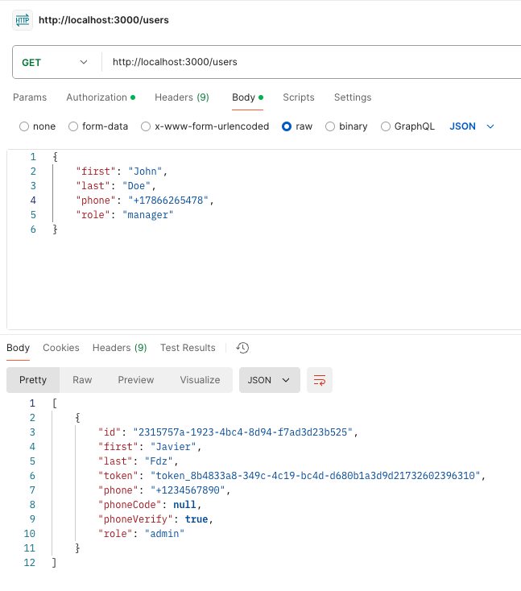
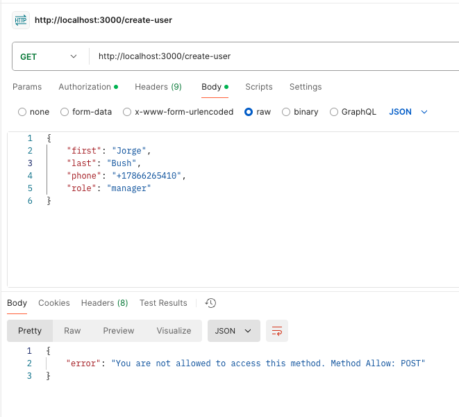
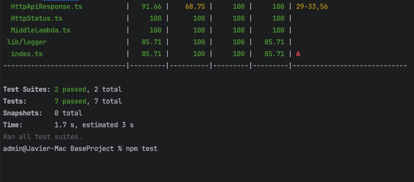

## Install

    - npm i -f

## DataSource

    - Data source is set in Sqlite3 :memory: database
    - Data source can be changed in `src/App/dataSource.ts`

## Run locally

    - npm start
    - Open browser and navigate to `http://localhost:3000`
        Auth type: Api Key
        key: TOKEN
        value: token_8b4833a8-349c-4c19-bc4d-d680b1a3d9d21732602396310
        add to header

## Endpoints

### Create user

    POST - /create-user
        body: {
            "first": "Jorge",
            "last": "Bush",
            "phone": "+17866265410",
            "role": "manager"
        }

### Get users

    GET - /users
        body: {}

### Access denied

    POST - /users
    body: {}
    - If you see access denied, please check the endpoint method

## Unit Test

    - npm test

